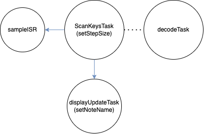
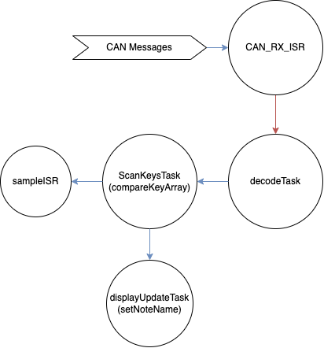
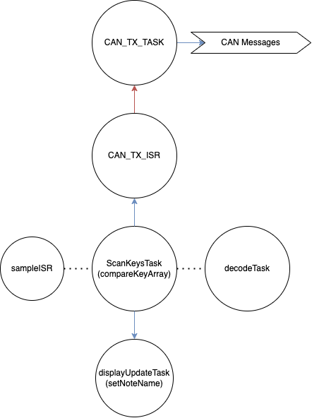

# Embedded Systems Coursework 2
## Features
- 5 Different Signal Waveforms Played by Adjusting Knob 0
- Polyphony of Signals on Single Keyboard and Multiple Keyboards with up to 8 simulaneous notes
- Volume Control using Knob 4
- Autohandshake for multiple keyboards


## Tasks Performed by System

### **scanKeysTask -> compareKeyArray/setStepSize**
The `scanKeysTask` is a **thread** used to update the keyArray according to the notes being played and knobs being turned. When multiple keyboards are connected it uses the `compareKeyArray` sub-function, otherwise as an individual keyboard it uses the `setStepSize` sub-function.


### **displayUpdateTask -> findNoteName**
The `displayUpdateTask` is a **thread** used to update the display according to the notes being played and the knobs. It uses the `findNoteName` sub-function to display notes and knobs on the LCD display.


### **decodeTask**
The `decodeTask` is a **thread** used to decode incoming CAN messages from the CAN bus and is triggered by the reception of a CAN message into the queue. This task is only carried out on the reciever module when there are multiple modules. Depending on the first value in the message array, the task will either take or remove keys from the stored `key_pressed` vector, or do the initialisation for receieved handshake signals.


### **CAN_RX_ISR**
The `CAN_RX_ISR` is a **interrupt service routine** used to trigger the `decodeTask` when a CAN message is received. It is called by the CAN library whenever a new message is available, and that message is put into a receive queue for the decodeTask to deal with.

### **CAN_TX_Task**
The `CAN_TX_Task` is a **thread** used to transmit CAN messages to the CAN bus. It is triggered only when there are messages in the queue and when the semaphor is released by the interrupt service routine, otherwise it will block and yield the thread to other tasks.

### **CAN_TX_ISR**
The `CAN_TX_ISR` is an **interrupt service routine** used to transmit CAN messages to the CAN bus. This interrupt is called whenever a CAN mailbox is available to send a message.

### **sampleISR**
The `sampleISR` is an **interrupt service routine** used to convert the notes being pressed as well as the volume and signal options to produce the corresponding sound for the keyboard.This task is sampled at a rate of 44000Hz as it is triggered 44,000 times a second.

## Shared Data Structures

```c
volatile int32_t currentStepSize[n];
volatile int32_t currentSineAcc[n];
```
The following two arrays are accessed by `sampleISR` and `scanKeysTask` to produce sounds based upon the notes being pressed. As these variables are accessed by an interrupt service routine, they are declared as volatile and atomically accessed with each entry as they represent independant notes.

```c
SemaphoreHandle_t keyArrayMutex;
volatile uint8_t keyArray[7];
```
The following array is accessed by `decodeTask`, `displayUpdateTask` and `scanKeysTask` to store the state of the key matrix on the piano. As all these tasks are threads, this array is protected by mutexes with non-blocking calls, ensuring no deadlock.

```c
SemaphoreHandle_t keysPressedMutex;
std::vector<uint16_t> keysPressed;
```
The following vector is accessed by `decodeTask` and `scanKeysTask` to store the keys being pressed with multiple keyboards. As all these tasks are threads, this vector is protected by mutexes with non-blocking calls, ensuring no deadlock.

```c
uint8_t TX_Message[8];
uint8_t RX_Message[8];
```
The two arrays that are used to store current CAN messages are not shared between threads or between ISRs, but we used queues to read and send messages from the interrupt service routine that receieves the message and the actual `decodeTask` that sends the message. These queues ensure thread safety and ensure that things happen in order rather than having a race condition. The use of queues to manage receieves also puts less pressure on the receieving ends of message and increases the initiation interval for each task.

## Intertask Blocking Dependencies

As the tasks blocking dependencies can vary based on the number of keyboards, the following images show the blocking dependencies for two cases. Image 1 shows the blocking dependencies for a single keyboard, and image 2 and 3 shows the blocking dependencies for a keyboard configured as a receiver and transmitter respectively.

Blue arrows represent data flow referring to differences that influence the execution time which are non-blocking. Red arrows are blocking true dependencies that mean the task will wait for the data to be available. Dotted arrows means that in the current configuration, there is no data flow between the tasks.





## Rate Monotonic Scheduler Critical Instant Analysis
| Task Name | Initiation Interval ($τ_i$) | Execution Time ($T_i$) | $[\frac{τ_n}{τ_i}]$ | $[\frac{τ_n}{τ_i}]T_i$| CPU Utilisation $[\frac{T_i}{τ_i}]$ |
| ----------- | ----------- | ----------- | ----------- | ----------- | ----------- |
| scanKeysTask | 50 ms | 0.1775 ms | 2 | 0.355 ms | 0.355% |
| displayUpdateTask | 100 ms | 16.27 ms | 1 | 16.27 ms | 16.27% |
| sampleISR | 0.02 ms | 0.01488 ms | 5000 | 74.4 ms | 74.4% |
| decodeTask | 0.512 ms | 0.02866 ms | 195 | 5.5887 ms | 5.5887% |
| CAN_RX_ISR | 0.512 ms | 0.005639 ms | 195 | 1.10 ms | 1.10% |
| CAN_TX_Task | 0.512 ms | 0.00815 ms | 195 | 1.589 ms | 1.589% |
| CAN_TX_ISR | 0.512 ms | 0.0030375 ms | 195 | 0.592 ms | 0.592% |
| Total | _ | _ | _ | 99.89495 ms | 99.89% |

It should be noted that the CPU Utilisation/Analysis showcases low thresholds due to the worst-case scenario of CAN communication being taken into account. We assume that the receives and transmits occur under the maximum bitrate. The rest of the scheduling is dominated by the high sample rate, displayUpdateTask and decodeTask, which together leave a threshold of about 15% CPU utilisation, making the program safe.